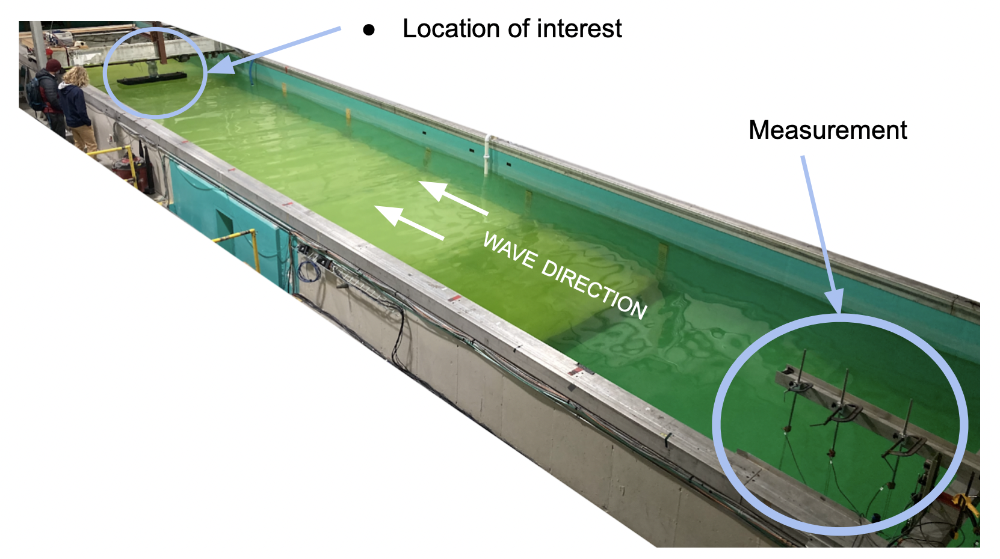

Background
==========

Most simply, wave reconstruction and propagation (WRP) is the process of using wave height measurements 
in one location to make phase resolved wave predictions at another. 

Below is an image of a physical wave tank in which we generate waves that travel in a single direction.
We measure waves at one location, and predict their shape further down the tank where a float sits on the surface. 

General technique
-----------------

The general approach to WRP is to deconstruct the entire wave field into a linear superposition of many constituent waves. 
Using linear wave theory, the speed of each constituent wave is known based the dispersion relation for water surface waves. 
With the combined knowledge of the constituent waves present and their speeds, the wave field can be propagated to a new location and time 
of interest.

To see the math which supports this framework, please read the page describing :doc:`theory`.