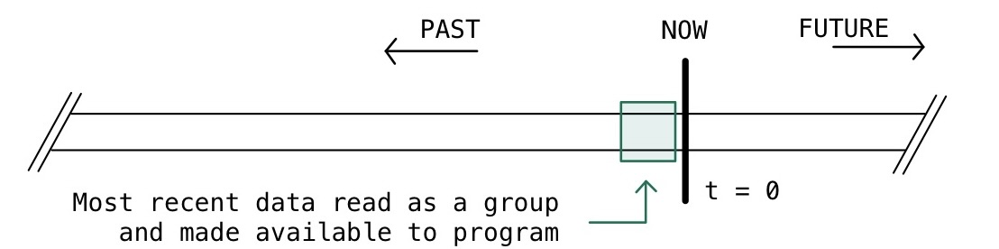
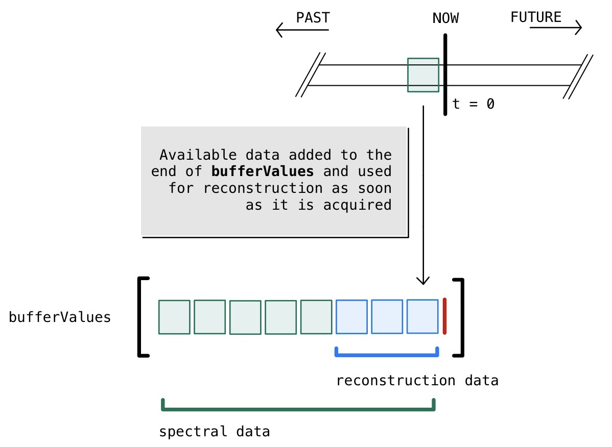
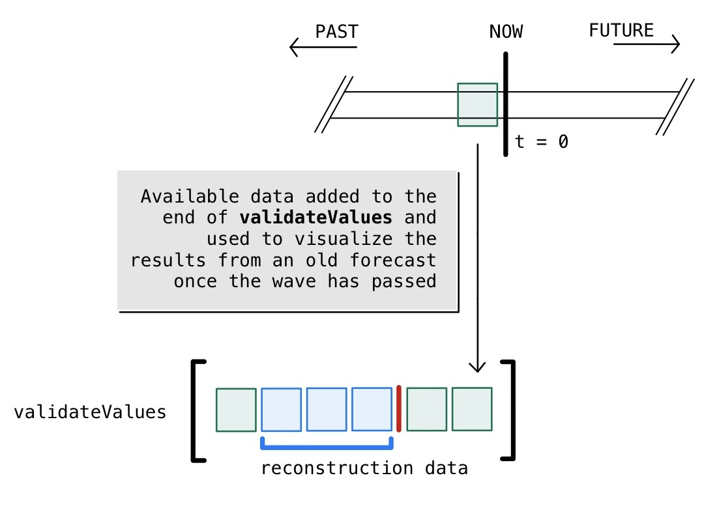
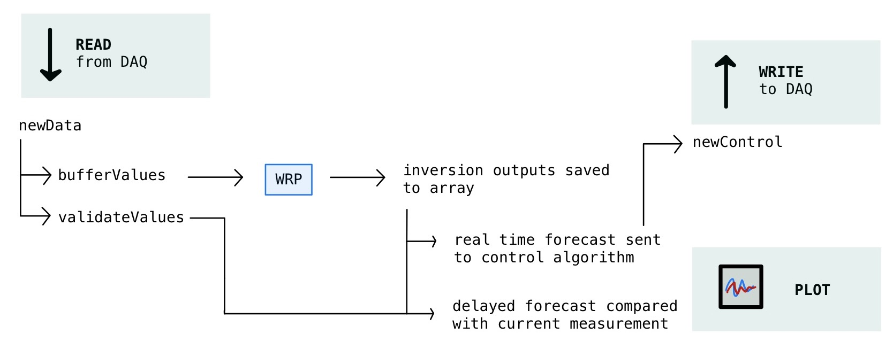
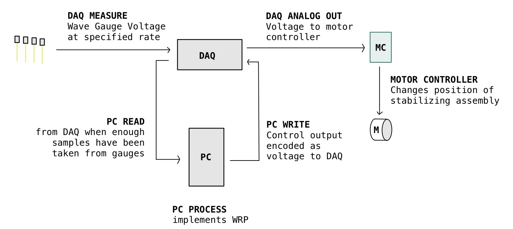

Overview
========

This code was developed to imitate the style of data acquisition through a National Instruments DAQ_. 
Data is handed in chunks to the PC whenever a certain number of samples accumulates in the `hardware` buffer,
which corresponds to a certain amount of time depending on the sampling frequency. 

.. _DAQ: http://www.ni.com/en-us/shop/pxi.html

When this collection of samples is given to the PC, it is used to update multiple `local` buffers. 
The first buffer of interest is an array with the name `bufferValues`. 
The new data is added to the end of the array, while the oldest values are removed. 
This buffer holds the data which will later be used for real time reconstruction and assimilation.

A second buffer is maintained locally to validate the previous reconstructions called `validateValues`. 
Wave predictions of course are made for the future, and can't be validated until the future wave can be actually measured. 
However, the active control system requires the future wave shape to be available immediately. 
This is the motivation for a second local buffer which is updated in the same way as the former when new data is available. 
In the video on :doc:`index`, as with real time plotting, the predictions are visualized based on `validateValues` which is 
a delayed version of the actual predictions.

   
A visualization of the ovarching processes happening on the PC. 
When a new chunk of data is given to the PC by the DAQ, a set of processes are triggered.
First, the new data is added to the end of `bufferValues` and `validateValues`. Then, inversion is done based on this updated 
array. The latest inversion is used to reconstruct and predict the surface at the same moment that the data is captured. 
Older saved inversions are used to plot and compare with the data saved for validation. This allows both the controller to have
the information it needs to operate in real time while giving the user intuitive understanding for how well the system is working.

Here we visualize the complete system with which we work for real time operation. The data is measured by the DAQ from a series
of wave gauges placed along the tank, and hands this data to the PC which processes it as described above. The real time output
is then used to generate an analog signal which is further passed to the motor controller. The motor controller (MC) takes this
and translates it into a desired position for the motor, which it executes while waiting for new data from the PC.

