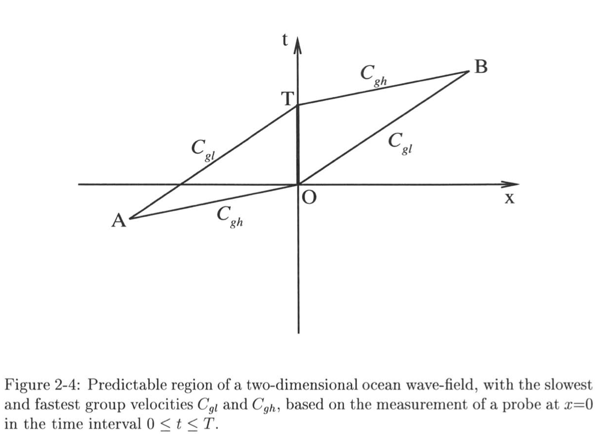
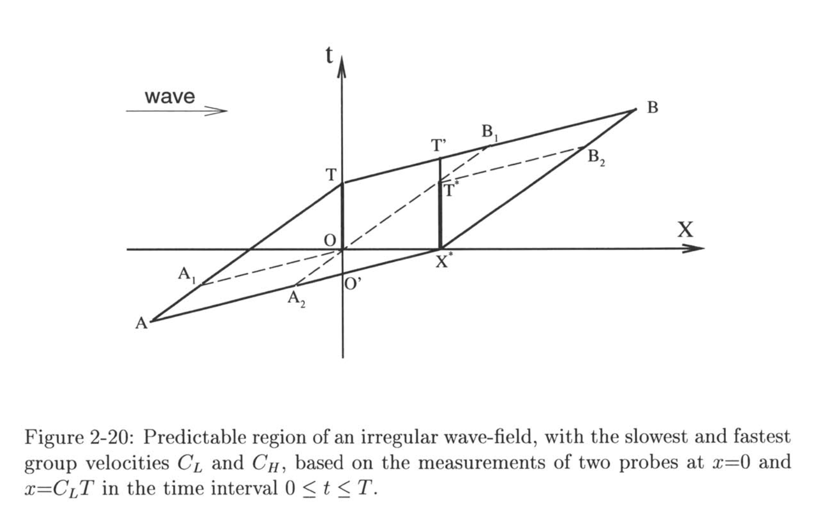

Theory
======

Assumptions
___________

To attempt to represent the continuous surface with a set of frequencies, we assume that the spectrum can be reasonably represented 
by a finite frequency bandwidth, which agrees well with natural ocean wave spectrum that tend to have most of their energy around 
some peak frequency. This aligns with work done by Wu in 2004.

We also assume that deep water wave relationships hold, or that the depth is greater than half the wavelength. This allows us to 
introduce the dispersion relation for deep water waves, relating the horizontal wavenumber :math:`k` with frequency :math:`\omega` as 

.. math::
    \omega^2 = gk

where :math:`g` is the constant of gravitational acceleration.

Prediction zone
_______________

The spatiotemporal region where we expect a good match between the reconstruction and reality is called the 'prediction zone.' 
The prediction zone is defined by the amount of time used to measure the waves and the speed of the constituent waves. 

The figures below are borrowed from Wu 2004 which illustrates the procedure for calculating prediction zone from a single probe. 
For :math:`x_p` values greater than the position of the measurement probe :math:`x`, the time window for reasonable predictions at 
:math:`x_p` is based on the slowest and fastest group velocities, :math:`C_{gl}` and :math:`C_{gh}` respectively.

.. math::
    \frac{ x_p - x }{ C_{gl} } 
    \leq t 
    \leq T_a + \frac{ x_p - x }{C_{gh}}

Prediction zone based on fastest and slowest group velocities, as well as assimilation time. Borrowed from Wu 2004.

Using multiple probes, the predictable region increases accordingly, where :math:`x` in the equation above becomes a reference to the largest and smallest locations in space.

.. math::
    \frac{ x_p - x_{\text{max}} } {C_{gl}} 
    \leq t 
    \leq T_a + \frac{ x_p - x_{\text{min}}}{C_{gh}}

Prediction zone for multiple wave gauges. Borrowed from Wu 2004.

Spectral calculations
_____________________

Separately from reconstruction, a longer time scale is used to calculate the one directional frequency wave spectrum. By default, 30 seconds of wave height information is assimilated into the spectrum. We do this with the pwelch method to calculate power spectral density at the measurement gauges, taking the average for the case with multiple gauges. This method in MATLAB requires specification of three parameters: 

From the spectrum, we calculate the zeroth moment :math:`m_0` as the area under the spectral curve. The significant wave height is then found as

.. math::
    H_s = 4 * \sqrt{m_0}

Peak period :math:`T_p` is simply the period associated with the peak of the energy curve, where :math:`T = 2\pi / \omega`.

The fastest and slowest group velocities used for the prediction zone are also derived from the spectrum. To select the frequencies corresponding to these group velocities, we find frequencies that represent some fraction of the peak energy of the spectrum. This paper defaults to using a threshold parameter :math:`\mu = 0.05` (5% of the peak energy) but experimented with using up to 15\% cutoff. Desmars et. al. chose this approach, arguing that the asymptotic nature of wave spectrum tends to bring the higher selected frequency to be too high. 

For deep water, group velocities are related to cutoff frequencies by

.. math::
    c_g = \frac{1}{2}c = \frac{g}{2\omega}

Representation of surface
_________________________

For multiple wave gauges, we use a similar representation of the surface as that in Grilli et. al., 2011. 
The linear scaling is represented in the scaling coefficients :math:`a_n` and :math:`b_n` where :math:`n` indicates a different frequency.

.. math::
    \eta_{\mathrm{L}}(\boldsymbol{x}, t)=\sum_{n=1}^{N} k_{n}^{-3 / 2}\left\{a_{n} \cos \Psi_{n}+b_{n} \sin \Psi_{n}\right\} ; \Psi_{n} = (k_nx - \omega_n t)

Inversion
_________

To reconstruct the surface using measurements now come from multiple locations, we cannot simply use the DFT from a single probe. 
Instead, we consider both the spatial and temporal components of each signal, and find optimal weights for linear constituent waves using linear regression.
The use of multiple gauges is important because in ocean applications multiple gauges are necessary to determine the direction of waves. 
This document does not develop the solution for multiple directions, though the process is similar.

The problem of finding optimal weights for reconstruction can be represented as linear regression in matrix form.

We first construct a data matrix :math:`\mathbf{X}` by evaluating :math:`\cos(\Psi_n)` and :math:`\sin(\Psi_n)` at every unique spatio-temporal point :math:`(x_l, t_l)`. 
This results in a matrix of size :math:`L \times 2N` where :math:`L` is the number of spatio-temporal points (this changes depending on the amount of past data used during reconstruction). 
The weight vector :math:`\mathbf{w}` contains :math:`a_n \cdot k_n^{-3/2}` and :math:`b_n \cdot k_n^{-3/2}`, and is of size :math:`2N \times 1`. 
By multiplying these together we get an estimation of the surface, :math:`\tilde{\eta}`, at each :math:`(1...L)` point.

.. math::
    \mathbf{\tilde{\eta}} = \mathbf{X}\mathbf{w}

We then want to minimize the cost function, where :math:`\eta` is the `true' or measured surface at each point.

.. math::
    C = \frac{1}{L}\left(\mathbf{X}\mathbf{w} - \eta\right)^2

The closed-form solution to this problem is well documented in sources on linear regression, and comes from finding the extremum where :math:`\frac{\partial C}{\partial \mathbf{w}} = 0`.

.. math::
    w^* = (\mathbf{X}^T \mathbf{X})^{-1}(\mathbf{X}^T \mathbf{\eta})

Using the definitions of :math:`\mathbf{X}` and :math:`\mathbf{\eta}` introduced above, we find the optimal weights for linear reconstruction.

Regularization of this linear regression, or penalizing overly strong weights for specific frequency has been implemented in other papers like Demars. et. al., and is a simple extension of our code. 
We introduce L2 regularization to our algorithm with scaling parameter :math:`\lambda`. The closed form solution with regularization is then 

.. math::
    w^* = (\mathbf{X}^T \mathbf{X} + \mathbf{\lambda}\mathbf{I})^{-1}(\mathbf{X}^T \mathbf{\eta})

For this stage of implementation we have set :math:`\lambda = 0.05`, and not looked into tuning this parameter.

Reconstruction bandwidth
________________________

To implement this algorithm, we need to define the frequencies and wavenumbers to be used to fit to surface itself. 
The definitions for the highest and lowest wavenumbers are taken from Desmars et. al. 2020, and frequencies are determined correspondingly using the dispersion relation.

The largest wavenumber :math:`k_{\text{max}}` is determined by the smallest distance between wave gauges :math:`L_{\text{min}}`. 
:math:`L_{\text{min}}` is easy to find using the given locations of wave gauges, and :math:`k_{\text{min}} = 2\pi / L_{\text{min}}`.

The smallest wavenumber :math:`k_{\text{min}}` is determined by the largest predictable region at reconstruction time :math:`L_{\text{max}}`. 
To find :math:`L_{\text{max}}`, define the locations of wave gauges as :math:`x_j`. 
The smallest predictable location is then :math:`x_b = \text{min}_j(x_j)`. 
The largest predictable location is :math:`x_j = \text{max}_j(x_j) + T_a c_{gl}`, where :math:`c_{gl}` is the slowest applicable group velocity. 
Finally, :math:`L_{\text{max}} = x_e - x_b`, and :math:`k_{\text{max}} = 2\pi / L_{\text{max}}`.

According to Wu, the frequency resolution can be optimized, because resolution over a certain point increases computational cost without a significant increase in the quality of the fit. 
We have not optimized this parameter, merely choosing something that looks effective. For the examples studied here we chose to use 100 frequencies in our representation.

.. \subsection{Results using multiple probes}

.. \subsubsection{Single instance}
.. We can again illustrate this method by visually comparing measured with predicted waves at a single wave gauge using data from 12/10/21. Here, we make a prediction at gauge 6 using measurements from gauges 1 to 5. Data assimilation time is 10 seconds, and reconstruction performed 120 seconds after starting data collection. 

.. The thick vertical lines represent theoretical prediction zone boundaries, and we expect good agreement within these lines and worse outside of it. The reconstruction time is shifted here to zero, where any thing after is a forecast while anything before is a hindcast. The plot has been normalized to peak period and significant wave height as measured using spectral methods, with 30 seconds of previous data. We once again see a good fit between the prediction and measurement. The difference in accuracy between a single and multiple gauges is not notable, but as mentioned earlier, this technique using multiple gauges will be necessary for applications where waves come from multiple directions. 

.. \begin{figure}[H]
.. \centering
.. \includegraphics[width=15cm]{figures/april/ng-single.png}
.. \caption{Comparison of measured with predicted wave heights using five wave probes.}
.. \label{fig:ng-single}
.. \end{figure}

.. Misfit indicator definition
.. ---------------------------

.. To assess the accuracy of our wave prediction across multiple realizations we define the following misfit indicator. 

.. .. math::
..     \epsilon(x, t) = \frac{1}{N_s}\sum_{i=1}^{N_s}|\eta(x,t) - \Tilde{\eta}(x,t)| / H_s

.. Where :math:`N_s` is the number of realizations, :math:`\eta` is the measured wave heights, :math:`\Tilde{\eta}` is the predicted wave heights,
.. and :math:`H_s` is the significant wave height calculated from the spectral data. For our experiments, multiple realizations were drawn from a 
.. single continuous wave generation by isolating data from completely different points in time. 
